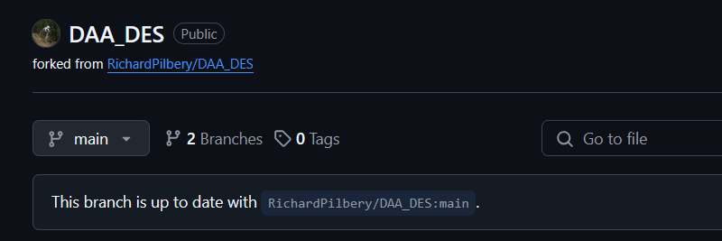

# Devon Air Ambulance Discrete Event Simulation

## Issue Tracking and Roadmap

Project issues are tracked using the Github issues system and can be accessed [here](https://github.com/RichardPilbery/DAA_DES/issues).

Project milestones can be found [here](https://github.com/RichardPilbery/DAA_DES/milestones?direction=desc&sort=title&state=open).

These project milestones currently supersede information contained in the `roadmap.md` file.

Tickets actively being worked on by contributors can be found on the [project board](https://github.com/users/RichardPilbery/projects/1).

## DES model logic

The model creates patient episodes and associated outcomes based on the following sequence:

1.  Obtain AMPDS card category based on hour of day
2.  Choose a callsign based on activation criteria, which helicopter (if any) is available, whether helicopter can currently fly (servicing or weather impacts),
3.  Based on callsign, determine the HEMS result (Stand Down Before Mobile, Stand Down En Route, Landed but no patient contact, Patient Treated (Not Conveyed), Patient Conveyed)
4.  Based on the HEMS result determine the patient outcome (Airlifted, Conveyed by land with DAA, Conveyed by land without DAA, Deceased, Unknown)

A full breakdown of the model logic can be found in **reference/daa_des_model_logic**


## Repository Structure

### Root

The model logic is stored in files in the root of the repository.

**class_ambulance.py**:
This file defines the core resource class.

**class_hems_availability.py**:
This file contains classes controlling the logic around the allocation of resources to jobs.

**class_hems.py**:
This file defines the HEMS class as a child of the core resource class defined in class_ambulance.

**class_patient.py**:
This file defines the core patient class. The model uses a single patient class.

**des_hems.py**:
This file is the key file controlling call generation and call journeys, and is where most of the logic relating to the patient journey is held.

**des_parallel_process.py**:
This file contains functions to perform a single run of the model, or multiple runs using parallel processing. It also handles the collation of results files and associated filespace cleanup.

*There are also several supporting files.*

**distribution_fit_utils.py**: This file contains functions and classes for fitting distributions from raw data. Note that instructions are currently not given for the required data format for using this on your own data. However, the distributions generated by these functions for the site the model is being developed for can be found in the *distribution_data* folder, allowing other parts of the app to be run in the absence of raw job-level data.

**utils.py**:
This file contains various supporting functions used across other files.


#### Model Structure Diagram

The model structure is further broken down in this diagram. However, note that this may not be fully up to date, and the files themselves should be consulted for key questions.


### actual_data

This folder contains key input data that is called upon by the model, pertaining to areas including rotas and servicing.

### app

This folder contains code relating to the generation of the interactive web app interface and the visuals and metrics that are generated to evaluate and debug the model.

### distribution_data

This folder contains the distributions that are generated from the call-level data and the file **distribution_fit_utils.py**.

### docs (DEPRECATED - to be removed)

This folder contains an early version of the planned Quarto documentation for this project. This has now been moved into a separate repository:

### historical_data

This folder contains aggregated historical data.

This data is currently used to visualise the historical range of data and compare it with the simulated results.

The data will also be used as part of the pytest testing suite to ensure models run with the parameters in use at the time these simulations were run successfully mimic the observed real-world patterns.

### readme_assets

This folder contains images used within this readme.

### reference

This folder contains

If editing the files, you should use the .drawio versions, which can be opened with the free tool diagrams.net.

It is recommended that you edit and export the diagrams in light mode, and export using a 50 pixel border, to ensure a consistent appearance is maintained.

### tests

This folder contains files that will be picked up by the pytest framework. They are planned to contain various tests including validation/verification tests, and unit tests.

To run all tests, use the command `pytest` in a terminal, running from the root folder of the project.

To run a subset of tests, you can choose subsets of tests. For example, to run all resource-related tests, run `pytest -m resources`. More options can be seen [here](https://docs.pytest.org/en/stable/example/markers.html).

Alternatively, see the [pytest documentation](https://docs.pytest.org/en/stable/how-to/usage.html) for additional ways to manage groups of tests.

To generate a code coverage report, run `pytest --cov=. --cov-report=html`.

## API Documentation

The function and class documentation can be accessed at the following link: [https://richardpilbery.github.io/DAA_DES/](https://richardpilbery.github.io/DAA_DES/)

This documentation is automatically generated using [Sphinx](https://www.sphinx-doc.org/en/master/) and will be regenerated when the code is updated on the main branch on Github.


## Data output items

The model generates a CSV file containing raw data, which can then be wrangled and presented separately, either following a model run(s) or at any time after the model has been run.

**All** runs of the model get added to the **all_results.csv** file.

The last run - whether run by the functions in can be found in the **run_results.csv** file.

The table below identifies the column headers and provides a brief description

| Column name               | Description |
| --------------------------| ------------------------------------------------------------------------------ |
| P_ID                      | Patient ID    |
| run_number                | Run number in cases where the model is run repeatedly (e.g. 100x) to enable calculations of confidence intervals etc.|
| time_type                 | Category that elapsed time represents e.g. 'call start', 'on scene', 'leave scene', 'arrive hospital', 'handover', 'time clear'|
| timestamp                 | Elapsed time in seconds since model started running |
| day                       | Day of the week as a string ('Mon', 'Tue', 'Wed', 'Thu', 'Fri', 'Sat', 'Sun') |
| hour                      | Hour of call as integer between 0–23 |
| weekday                   | String identifying whether the call started on a weekday or weekend |
| month                     | Integer representing the month of the year (1–12) |
| qtr                       | Integer representing the yearly quarter of the call (1–4) |
| callsign                  | String representing callsign of resource (either HEMS or Ambulance service) |
| triage_code               | Call triage outcome represented as one of the AMPDS 'golden' codes (or OTHER) |
| age                       | Integer representing patient age in years |
| sex                       | String representing patient sex ('male', 'female') |
| time_to_first_response    | Integer representing time in minutes to first response (ambulance service or HEMS) |
| time_to_cc                | Integer representing time in minutes to first HEMS response |
| cc_conveyed               | Integer indicating whether HEMS conveyed patient (1 or 0) |
| cc_flown                  | Integer indicating whether HEMS conveyed the patient by air (1 or 0) |
| cc_travelled_with         | Integer indicating whether patient was conveyed by ambulance but HEMS personnel travelled with the patient to hospital (1 or 0) |
| hems                      | Integer indicating whether HEMS attended the incident (1 or 0) |
| cc_desk                   | Integer indicating whether HEMS activation was due to critical care desk dispatch |
| dispatcher_intevention    | Integer indicating whether the ambulance service dispatcher activated HEMS for a called which did not meet auto-dispatch criteria (1 or 0) |


## Environment Setup

The core environment is provided in the `requirements.txt` file in the root folder of the repository.

This has been used in conjunction with Python 3.11.9.


## Web App

Assuming you have installed the environment as above, the web app can be run using the command

`streamlit run app/app.py`

When running locally, the app will attempt to use multiple cores of the user's computer to undertake several runs of the model simultaneously.

### R

Several additional debugging files are generated using R and the bupaverse packages.

You will need R installed on your machine, with your R exe path added to your machine's PATH environment variable.

You will also need to install the following R packages:

```
install.packages("readr")
install.packages("bupaverse")
install.packages("processanimateR")
install.packages("processmapR")
install.packages("DiagrammeR")
install.packages("ggplot2")
install.packages("htmlwidgets")
```

An warning message will be displayed in the app if these additional process maps cannot be generated due to your R configuration.

### Quarto

If you wish to be able to download the output from the web app as a Quarto file, you will need to also install Quarto.

Quarto can be downloaded at [https://quarto.org/docs/get-started/](https://quarto.org/docs/get-started/).

- It is recommended that, when asked by the installer, you add Quarto to your PATH variable.
- It is important to note that while a [Python package for quarto exists](https://pypi.org/project/quarto/), this is not the full Quarto command line utility, which will need to be installed separately.


### Hosted version of web app

The Streamlit app is also available at the following link: [https://daa-des-demo.streamlit.app/](https://daa-des-demo.streamlit.app/)

Note that for permissions reasons, the hosted version of the app runs off a fork ((https://github.com/Bergam0t/DAA_DES)[https://github.com/Bergam0t/DAA_DES]) instead of this main repository.
Therefore, the hosted version may not always be the most up to date version of the app.

You can determine if the fork is currently up to date with this repository by navigating to the fork using the link above and looking at the following message.



Note that due to limitations of the hosting platform, each run of the model is undertaken sequentially, not in parallel, so execution times are much longer.

## Estimated Run Times

As of March 2025, the app has been tested on a pc with the following specs

- OS: Windows 11 (Version 10.0.22631 Build 22631)
- Processor: 12th Gen Intel(R) Core(TM) i7-12700H, 2300 Mhz, 14 Core(s), 20 Logical Processor(s)
- Installed Physical Memory (RAM): 32.0 GB

When executing the model through the streamlit interface, the following run times were observed.

**1 year simulated time, default demand, default parameters (2 helicopters, 1 additional car)**

- 1 run, 365 days: TBD
- 10 runs, 365 days: TBD
- 30 runs, 365 days: TBD

**3 years simulated time, default demand, default parameters (2 helicopters, 1 additional car)**

- 1 run, 1095 days (3 years): TBD
- 10 runs, 1095 days (3 years): TBD
- 30 runs, 1095 days (3 years): TBD
